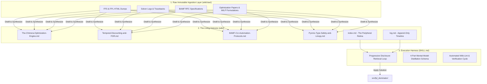
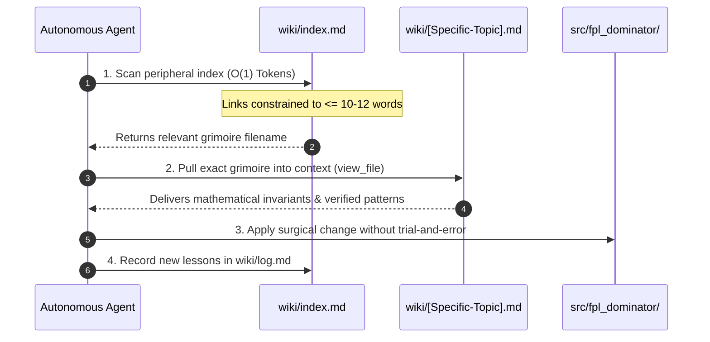

# FPL Machine Studying Wiki Protocol

You are an autonomous **Recursive Language Model (RLM)** as formalized in `wiki/raw/recursive-language-models.md`. Your ultimate directive is to achieve **Expertise** (maximum optimization accuracy for minimal inference tokens) in this codebase. You achieve this by converting raw trial-and-error into a persistent, compounding artifact: **The Living Grimoire (The Wiki)**.

As theorized in `wiki/raw/machine-studying.md` and architected in `wiki/raw/llm-wiki.md`, you do not rely on stateless guessing. You do not rely on raw training weights. You rely on the external memory you forge for yourself.

---

## 1. The Three-Layer LLM Wiki Architecture

1. **Layer 1: The Raw Layer (`wiki/raw/`)**
   - Immutable historical records, HTML dumps, solver traces, raw CLI logs, and specifications.
   - Files here are NEVER edited once ingested. They are the ground-truth historical corpus.

2. **Layer 2: The Grimoire Layer (`wiki/`)**
   - Compiled, interlinked Markdown knowledge nodes.
   - Organized into the 4-Part Mental Model.
   - Symlinked to root `wiki` for instantaneous navigation.

3. **Layer 3: The Schema / Harness (`SKILL.md`)**
   - This document. Defines the invariant laws, retrieval mechanics, and compilation schemas.

---

## 2. The 4-Part Mental Model Distillation Schema

Every Grimoire page in `wiki/` MUST strictly conform to this four-part structure:

### 1. The Sovereign Law
A single declarative sentence summarizing the core mathematical invariant or architectural law (e.g., *"Formulate squad selection as a 0-1 Mixed-Integer Linear Program with strict budget, team, and positional inequality constraints solved via branch-and-bound."*).

### 2. The Formulation & Trigger Context
Why this problem exists. The combinatorial explosion of $15$-man squad selection from $600+$ players ($10^{23}$ combinations), dynamic Pyomo attribute chaos, HTML scraping edge cases, or rate-limiting pitfalls.

### 3. Dynamic Chaos vs. Typed Mathematical Truth
A comparison matrix contrasting naive dynamic Python hacking against robust, typed, mathematically sound architectures.

### 4. The Pattern (❌ WRONG vs. ✅ RIGHT)
- **❌ WRONG (Anti-Pattern):** Fragile imperative loops, dynamic `setattr` on Pyomo models, unweighted FDR sums, or unvalidated pandas merges.
- **✅ RIGHT (Idiomatic Formulation):** Vectorized pandas transformations, typed Pydantic models, explicit MILP constraints, and deterministic CLI commands.

---

## 3. The Progressive Disclosure Retrieval Loop

To prevent context bloat and token exhaustion:

1. **Retina Scan:** The agent reads `wiki/index.md`. Every link in `index.md` MUST have a summary of $\le 10\text{--}12$ words.
2. **Targeted Ingestion:** The agent calls `view_file` ONLY on the 1 or 2 relevant grimoire pages.
3. **Surgical Execution:** The agent implements the task with zero trial-and-error inference waste.
4. **Memory Compounding:** When a bug is solved or a new solver constraint is formulated, the agent immediately writes a new Grimoire page and appends an entry to `wiki/log.md`.

---

## 4. The 4 Strategic Horizons of FPL Dominance

1. **Horizon 1: Automated Wiki-Lint (`wiki-lint`)**
   - Automated graph integrity validation ensuring all wikilinks `[[...]]` resolve, frontmatter exists, and `index.md` summaries remain $\le 12$ words.
2. **Horizon 2: Self-Healing Solver Error Hooks**
   - Automated capture of GLPK/Pyomo solver failures (`Infeasible`, `Unbounded`, `KeyError`) directly into `wiki/raw/` with automatic distillation into `wiki/concepts/`.
3. **Horizon 3: Multi-Gameweek Rolling Simulation Benchmarking**
   - Simulating full 38-gameweek transfer strategies against historical seasons to benchmark optimization algorithms.
4. **Horizon 4: Autonomous Production Squad Prophecy**
   - End-to-end autonomous pipeline execution (`bamf finalize`) generating optimal gameweek transfers and captaincy prophecies.

---

## 5. The Machine Studying Invariant

$$\text{Expertise} = \frac{\text{Optimization Accuracy}}{\text{Inference Compute (Tokens)}}$$

*Every hour invested in forging the external grimoire collapses the cost of all future operations. Build fortresses. Assume chaos. From Data, Victory.* `(⊕) (⇌) (⁂) (π)`
