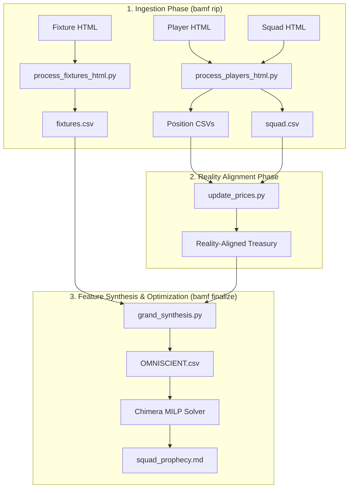

# The BAMF CLI Command Deck & RIP Protocol

## 1. The Sovereign Law
Eliminate manual data entry errors by channeling all Gameweek operations through the unified `bamf` CLI: use `bamf init` to forge the Gameweek vault, `bamf rip` to transmute raw browser clipboard OuterHTML into structured CSVs, and `bamf finalize` to execute the end-to-end data pipeline to solver prophecy.

---

## 2. The Trigger & Context
Manual data entry in competitive fantasy modeling leads to catastrophic strategic blunders:
- **Typo Purgatory:** Miscopying player prices ($0.1\text{m}$ error causing model infeasibility), mistyping fixture difficulties, or forgetting bench selling values.
- **Context Switching Friction:** Manually saving CSV files, renaming columns, and running 6 separate python scripts in loose terminal tabs.
- **The RIP Protocol Solution:** As codified in `BAMF-RFC-001_RIP.md`, the Carbon Pirate navigates to FFS/FPL, copies the OuterHTML of the table to the system clipboard (`xclip`), and executes single-word CLI commands (`bamf rip mid`, `bamf rip fix`). The engine parses, cleans, normalizes team aliases, and writes the CSV directly into the active Gameweek vault.

---

## 3. The BAMF Pipeline Architecture



---

## 4. The Operational Ritual (Step-by-Step)

### Step 1: Initialise the Vault
```bash
bamf init gw30
```
*Creates `/home/ian/Projects/fpl-dominator/gw30/` and updates the active vault pointer.*

### Step 2: The Ritual of the Rip
Copy table `OuterHTML` from browser, then execute:
- `bamf rip fix` (Overall FDR)
- `bamf rip fix-a` (Attack FDR)
- `bamf rip fix-d` (Defence FDR)
- `bamf rip gkp` (Goalkeepers)
- `bamf rip def` / `bamf rip def2` (Defenders)
- `bamf rip mid` / `bamf rip mid2` (Midfielders)
- `bamf rip fwd` / `bamf rip fwd2` (Forwards)
- `bamf rip squad` (Current Squad & Selling Prices)

### Step 3: The Single Strike (`finalize`)
```bash
bamf finalize gw30
```
*Executes HTML parsing $\rightarrow$ Price Alignment $\rightarrow$ Temporal Feature Synthesis $\rightarrow$ MILP Pyomo Solver $\rightarrow$ Generates `squad_prophecy.md`.*

---

## 5. Defensive Verification Protocol

Always verify data integrity before trusting the prophecy:
```bash
# Audit player name matching across sources
bamf audit players gw30

# Audit team name normalizations
bamf audit teams gw30
```

---

## 6. Season Rollover Protocol

When transitioning across seasons (e.g. from 2025/26 to 2026/27):
```bash
# 1. Tag repository state at season conclusion
git tag -a season-2025-26-final -m "Final state of 2025/26 FPL Season"

# 2. Archive active gameweek vaults
bamf archive-season 2025-26

# 3. Initialize fresh campaign vault
bamf init gw1
```

