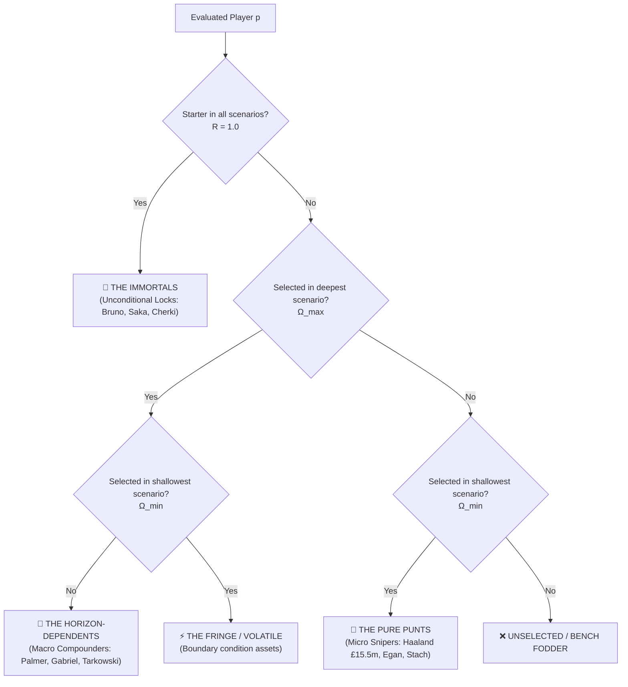

# Temporal Gradients, Effective Horizon Depth & Asset Survival Curves (RFC-009)

## 1. The Sovereign Law
Classify fantasy asset survival curves by evaluating selection invariance across continuous parameter gradients ordered by Effective Horizon Depth $\Omega(s) = \sum_{t=1}^H W_s(t)$, separating structural cornerstone Immortals from short-term Pure Punts and deep-fixture Horizon-Dependents.

---

## 2. The Trigger & Context
Managers often categorize players using static labels: "Must-own", "Template", or "Differential". In a dynamic linear program with a £100.0m budgetary ceiling, these subjective labels fail because player value is an emergent property of the optimization horizon:
- **The Macro Fallacy:** Assuming a player optimal across a 5-week flat horizon ($\lambda=1.0$) is equally optimal for an immediate single-gameweek captaincy or Wildcard setup.
- **The Premium Asset Dilemma:** Ultra-expensive talisman assets (e.g., Erling Haaland at £15.5m) consume over 15% of the total squad budget. Over long horizons, capital allocation favors multi-asset diversification (Palmer, Gabriel, Gibbs-White, Tarkowski); over hyper-short horizons, raw individual ceiling dominates.
- **The Solution:** As specified in RFC-009, systematically interpolate decay parameters ($\lambda$ from $1.0$ down to $0.0$) across $N \ge 3$ steps to generate continuous survival curves.

---

## 3. Dynamic Chaos vs. Typed Mathematical Truth

| Dimension | Naive Single-Solve Intuition | Survival Curve Taxonomy (RFC-009) |
| :--- | :--- | :--- |
| **Asset Categorization** | Qualitative heuristics ("He is fixture-proof", "He is a differential"). | **Mathematical Classification:** Based on selection at horizon extremes ($\Omega_{\min}, \Omega_{\max}$). |
| **Horizon Metric** | Vague terminology ("short-term" vs "long-term"). | **Effective Horizon Depth:** $\Omega(s) = \sum_{t=1}^{H} W_s(t)$, quantifying the exact total fixture weight. |
| **Capital Allocation** | Static squad with £0.0m bank buffer. | **Dynamic Capital Reinvestment:** Identifies when heavy premiums trigger squad structural collapse into budget enablers. |
| **Robustness Metric** | Binary ("In squad" or "Out of squad"). | **Continuous Robustness:** $R(p) = \frac{\sum \mathbb{I}(p \in \text{Starter}_s)}{N_{\text{scenarios}}}$. |

---

## 4. The Mathematical Survival Taxonomy



### The 4 Core Archetypes:
1. **The Immortals ($R(p) = 1.0$):**
   Selected across all scenarios regardless of horizon length or decay rate. These are mathematically essential assets providing maximum efficiency per pound.
   *Empirical Example (GW3):* Bruno Fernandes (£12.0m, $R=100\%$), Bukayo Saka (£9.5m, $R=100\%$), Rayan Cherki (£7.7m, $R=100\%$), Riccardo Calafiori (£5.6m, $R=100\%$).
2. **The Horizon-Dependents ($p \in \Omega_{\max} \land p \notin \Omega_{\min}$):**
   Assets optimal only when multiple gameweeks of fixture equity compound over time. When horizons shrink, their expected value is overtaken by immediate high-variance options.
   *Empirical Example (GW3):* James Tarkowski (£6.0m, $R=60\%$), Gabriel (£8.0m, $R=40\%$), Cole Palmer (£9.6m, $R=40\%$), Morgan Gibbs-White (£7.9m, $R=40\%$).
3. **The Pure Punts ($p \in \Omega_{\min} \land p \notin \Omega_{\max}$):**
   Assets optimal only when future gameweeks are heavily discounted or ignored ($\lambda \le 0.50$). These are short-horizon scalpels.
   *Empirical Example (GW3):* Erling Haaland (£15.5m, $R=60\%$), John Egan (£4.0m, $R=60\%$), Anton Stach (£6.0m, $R=60\%$), Cody Gakpo (£7.0m, $R=40\%$).
4. **The Fringe / Volatile:**
   Assets that appear intermittently across internal steps due to integer-programming edge-case transitions.

---

## 5. The Implementation Pattern

### ❌ WRONG: Manual Ad-Hoc Weight Tweaking
```python
# Anti-Pattern: Subjective, non-reproducible manual weights
if user_wants_short_term:
    weights = [1.0, 0.2, 0.0, 0.0, 0.0]
else:
    weights = [1.0, 1.0, 1.0, 1.0, 1.0]
# Fails to map the transition boundary or measure survival curves
```

### ✅ RIGHT: Automated Gradient Interpolation & Classification (`scenario_forge.py`)
```python
from fpl_dominator.scenario_forge import (
    generate_gradient_matrix,
    run_scenario_matrix,
    classify_survival_curve,
)

# 1. Generate smooth exponential decay gradient across 5 steps
scenarios = generate_gradient_matrix(
    model_type="exponential",
    start=1.0,
    end=0.0,
    steps=5,
    horizon=5,
)

# 2. Run in-memory matrix
report = run_scenario_matrix("gw3", scenarios=scenarios)

# 3. Access rigorously classified cohorts
print(f"Immortals: {report.immortals}")
print(f"Pure Punts: {report.pure_punts}")
print(f"Horizon-Dependents: {report.horizon_dependents}")
```
