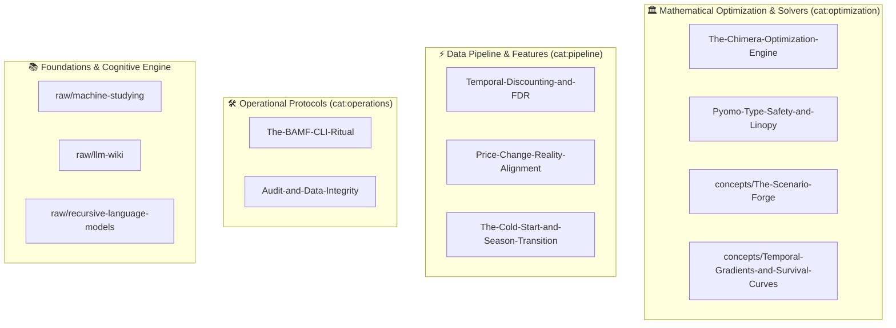

# BAMF Dominator Wiki Index

## 📚 Sources & Curriculum
- [[raw/sources]] - Master curriculum manifest and source ingestion tracker.
- [[raw/llm-wiki]] - Architecture and operating principles for persistent LLM knowledge bases.
- [[raw/machine-studying]] - Theory of token minimization and autonomous machine expertise.
- [[raw/recursive-language-models]] - Mechanics of recursive agent loops and grimoire creation.
- [[log]] - Chronological append-only timeline of knowledge base milestones.

## 🏛️ Mathematical Optimization & Solvers
- [[The-Chimera-Optimization-Engine]] - Mixed-Integer Linear Program (MILP) squad selection solved via Pyomo and GLPK.
- [[concepts/Pyomo-Type-Safety-and-Linopy]] - Eliminating dynamic Pyomo attributes using Typed Protocols and Linopy.
- [[concepts/The-Scenario-Forge]] - In-memory multi-scenario MILP stability matrix and diff-first noise suppression (RFC-008).
- [[concepts/Temporal-Gradients-and-Survival-Curves]] - Parameter sensitivity gradients mapping Immortals, Horizon-Dependents, and Pure Punts (RFC-009).

## ⚡ Feature Engineering & Data Pipeline
- [[Temporal-Discounting-and-FDR]] - Weighted decay horizon mathematics replacing naive arithmetic means for fixture difficulty.
- [[concepts/Price-Change-Reality-Alignment]] - Harmonizing bank balances and selling values against market price shifts.
- [[concepts/The-Cold-Start-and-Season-Transition]] - Bayesian prior decay schedule resolving GW1 zero-point singularity in player scoring.

## 🛠️ Operational Protocols & CLI Deck
- [[The-BAMF-CLI-Ritual]] - End-to-end Gameweek workflow: init vault, rip clipboard HTML, finalize prophecy.
- [[concepts/Audit-and-Data-Integrity]] - Automated player name aliasing and reality verification tests.
