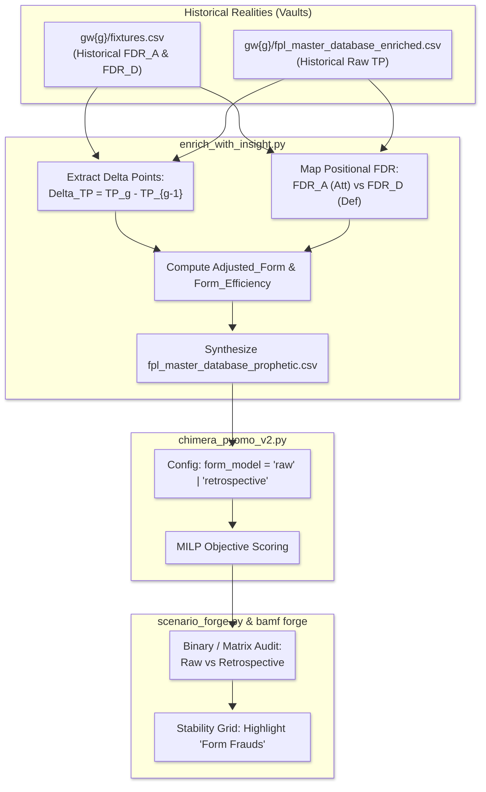

# RFC-011: The Retrospective Lens (Fixture-Adjusted Form)
**STATUS: IMPLEMENTED** `(⊕) (⇌)`

## 1. Abstract
Currently, the Chimera utilizes a raw `Form Factor` (calculated from points scored over a lookback period). This "blind" approach treats all points as equal, regardless of the opposition's strength. RFC-011 proposes the **Retrospective Lens**: a mechanism to weight previous points by the difficulty of the fixtures in which they were scored. This transforms "Raw Form" into "Contextual Efficiency," allowing the solver to distinguish between players who "stat-padded" against weak defenses and players who maintained production against elite opposition.

## 2. The Problem: The "Stat-Padding" Fallacy
Raw points are a lagging indicator that can be misleading. A player scoring 10 points against a bottom-three defense is not necessarily as "in-form" as a player scoring 6 points against the league leaders. 

By ignoring the **Historical FDR**, the Chimera is susceptible to:
- **Chasing Ghost Form:** Overvaluing players whose recent success is a product of a "soft" schedule.
- **Under-valuing Suppressed Elites:** Ignoring players who are performing well relative to a brutal schedule, but whose raw totals are low.
- **Synthesized vs. Raw TP Subtraction Gremlin:** In early implementations, rolling form subtracted historical raw points from 38-game Bayesian annualized points, distorting form signals during season transitions.

## 3. Proposed Solution: The Retrospective Lens
Implement a weighting mechanism that adjusts points based on the historical FDR of the specific fixtures they were earned in.

### 3.1 Mathematical Formulations

#### 1. The Adjusted Form Calculation
Instead of a simple average or sum of points, `Adjusted_Form` is calculated as the sum of points scored in each lookback gameweek, weighted by the normalized historical FDR for that fixture:

$$\text{Adjusted\_Form}_i = \sum_{g=T-L}^{T-1} \left( \Delta \text{Points}_{i, g} \times \frac{\text{FDR}_{i, g}^{\text{hist}}}{1000.0} \right)$$

Where:
- $T$: The target gameweek being solved (e.g. GW4).
- $L$: Lookback window depth in weeks (`form_lookback_weeks`, default = 2).
- $\Delta \text{Points}_{i, g} = \text{Raw\_TP}_{i, g} - \text{Raw\_TP}_{i, g-1}$.
- $\text{FDR}_{i, g}^{\text{hist}}$: The historical fixture difficulty rating from gameweek $g$'s fixture ticker.
- $1000.0$: Normalization denominator aligning baseline FDR ($\approx 1000\text{--}1350$) into an intuitive scaling multiplier ($\approx 1.0\text{--}1.35$).

#### 2. Positional Bifurcation Invariant
Historical FDR must respect positional nature just like future FDR horizon calculations in `grand_synthesis.py`:
- **For Midfielders and Forwards (MID, FWD):** Evaluate against $\text{FDR}_A$ (opponent defensive resistance / attack difficulty).
- **For Goalkeepers and Defenders (GKP, DEF):** Evaluate against $\text{FDR}_D$ (opponent attacking firepower / clean sheet difficulty).

$$\text{FDR}_{i, g}^{\text{hist}} = \begin{cases} \text{FDR}_{A, g}^{\text{team}(i)} & \text{if } \text{Position}(i) \in \{\text{MID}, \text{FWD}\} \\ \text{FDR}_{D, g}^{\text{team}(i)} & \text{if } \text{Position}(i) \in \{\text{GKP}, \text{DEF}\} \end{cases}$$

#### 3. The Efficiency Ratio Metric
As an augmentation to absolute adjusted points, we compute **Form Efficiency**:

$$\text{Form\_Efficiency}_i = \frac{\sum_{g=T-L}^{T-1} \Delta \text{Points}_{i, g}}{\sum_{g=T-L}^{T-1} \text{xPts}(\text{FDR}_{i, g}^{\text{hist}})}$$

Where $\text{xPts}(\text{FDR})$ models benchmark expected points as a decaying function of opposition difficulty:
$$\text{xPts}(\text{FDR}) = \text{Baseline\_Pts}_{\text{pos}} \times \left( \frac{1150.0}{\text{FDR}} \right)$$

Assets with $\text{Form\_Efficiency} > 1.0$ are outperforming their schedule difficulty.

---

## 4. Operational & Architecture Pipeline

### 4.1 Data Requirements & Historical Vault Ingestion
- Historical FDR is extracted directly from existing gameweek vaults (`gw{g}/fixtures.csv` where `Gameweek == f"GW{g}"`).
- Raw gameweek points are extracted from `gw{g}/fpl_master_database_enriched.csv`.
- If historical vaults do not exist (e.g. GW1 or missing vaults), the engine gracefully falls back to available in-season points or baseline priors with defensive logging.

### 4.2 Equation Update in Pyomo Solver
The `Final Score` equation in `chimera_pyomo_v2.py` is parameterized by `form_model`:
$$\text{Final\_Score} = \frac{\text{PP} + \text{SPP} + (\text{Form\_Metric} \times \text{weight})}{\text{Effective\_FDR\_Horizon\_5GW}}$$

Where:
$$\text{Form\_Metric} = \begin{cases} \text{Form\_Factor} & \text{if } \text{form\_model} = \text{'raw'} \\ \text{Adjusted\_Form} & \text{if } \text{form\_model} = \text{'retrospective'} \end{cases}$$

### 4.3 Validation via Scenario Forge
The impact of the Retrospective Lens is audited using `bamf forge`:
- Scenario A: `form_model = "raw"`
- Scenario B: `form_model = "retrospective"`
The resulting **Stability Grid** highlights **"Form Frauds"**—players who lose their starting berth once fixture difficulty weighting is applied.

---

## 5. Strategic Value
- **The "Fraud" Detector:** Rapidly identifies players whose form is purely a byproduct of a weak schedule.
- **The "Sleeper" Finder:** Identifies elite assets whose underlying production remained elite despite a brutal schedule.
- **Increased Optimization Robustness:** Mitigates the recency-bias trap in MILP squad selection.
