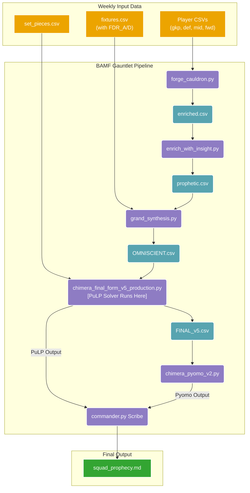

# PROJECT: BAMF DOMINATOR - OPERATIONAL GRIMOIRE (v4.1)

```python
BAMF_ART = r"""
██████╗  █████╗ ███╗   ███╗███████╗
██╔══██╗██╔══██╗████╗ ████║██╔════╝
██████╔╝███████║██╔████╔██║███████╗
██╔══██╗██╔══██║██║╚██╔╝██║██╔════╝
██████╔╝██║  ██║██║ ╚═╝ ██║██║
╚═════╝ ╚═╝  ╚═╝╚═╝     ╚═╝╚═╝
"""
```

## MISSION STATEMENT

To systematically dismantle and dominate the Fantasy Premier League simulation by transforming raw, chaotic data into a decisive strategic advantage. This project is the home of the **Chimera**, a Python-based squad optimisation engine commanded via the `bamf` CLI. Our motto: **EX DATA, VICTORIA** (From Data, Victory).

---

## SETUP & INSTALLATION

To unleash the Chimera, you must first prepare the forge.

### 1. System Dependencies

The Chimera's heart, the `pyomo` model, requires a solver. We use `glpk`.

```bash
# For Debian/Ubuntu-based systems
sudo apt-get update && sudo apt-get install -y glpk-utils
```

### 2. Python Environment & Package Installation

We use `uv` for lightning-fast package management and install the project in "editable" mode. This transforms our scripts into a system-recognised executable.

```bash
# 1. Create and activate a virtual environment
uv venv
source .venv/bin/activate

# 2. Install the project (and dependencies) in editable mode
uv pip install -e .
```

### 3. Advanced Shell Integration (Optimised Auto-Complete & Performance)

To achieve true symbiosis with the Command Deck, we configure the shell for **zero-latency** auto-completion and optimised execution.

**Step 1: Forge the Completion Artefact**
Instead of generating the completion logic dynamically every time the shell starts (slow), we generate it once and save it to a hidden file.

_Run this command in your terminal:_

```bash
_BAMF_COMPLETE=bash_source bamf > ~/.bamf-complete.bash
```

**Step 2: Update Shell Configuration**
Add the following lines to your shell's config file (e.g., `~/.bashrc`) to source the static file and disable the Global Interpreter Lock for maximum Pandas velocity.

```bash
# --- BAMF DOMINATOR CONFIG ---

# 1. Load optimised auto-completion (Static File)
# Reference: https://click.palletsprojects.com/en/stable/shell-completion/
if [ -f ~/.bamf-complete.bash ]; then
    . ~/.bamf-complete.bash
fi

# 2. Disable GIL for Pandas/Numpy performance
# This suppresses the RuntimeWarning and unlocks raw speed.
export PYTHON_GIL=0
```

**Step 3: Activate**
Reload your shell to apply the changes.

```bash
source ~/.bashrc
```

> **(π) Pirate Note:** If you update the `bamf` CLI commands significantly in the future, remember to re-run **Step 1** to regenerate the completion artifact!

---

## THE COMMAND DECK (`bamf` CLI)

All operations are now channeled through our master command-line interface, `bamf`.

**Available Commands:**

- `init`: Creates a new, clean gameweek vault, ready for data.
- `audit`: A group of commands to inspect data integrity.
  - `audit teams`: Checks for team name consistency.
  - `audit players`: Checks for player name matching issues.
- `run-gauntlet`: Executes the entire data-processing and squad-optimising pipeline.
- `run-scenario`: Runs a 'what-if' simulation with player constraints.

---

## SYSTEM ARCHITECTURE

The `run-gauntlet` command executes a multi-stage data pipeline, transforming raw weekly data into a final, optimized squad prophecy. The flow of data through the various scripts and databases is as follows:



---

## THE WEEKLY RITUAL

This is the precise, non-negotiable workflow to be executed at the start of each new Gameweek, using the `bamf` CLI.

### Step 1: Initialise the Vault

Create the directory and all necessary template files for the new gameweek.

```bash
bamf init gw12
```

### Step 2: The Gathering (Manual Data Update)

The Chimera is omniscient, but it cannot see data that does not yet exist. You, the `(π)` Pirate, must provide the weekly sacrifice of fresh intelligence by filling in the newly created files in the `gw12` directory.

- **Player Data (`goalkeepers.csv`, etc.):** Update with the latest **Market Price** and **Total Points (TP)**.
- **Squad Data (`squad.csv`):** Update with your current squad's **Purchase Price (PP)**.
- **Fixture Data (`fixtures.csv`) - THE TRINITY PROTOCOL:**
  The Chimera now demands nuance. You must consult the **Grey-scale Ticker** and extract data for **three separate views**:
  1.  **Overall** -> Maps to `FDR`
  2.  **Attack** -> Maps to `FDR_A`
  3.  **Defence** -> Maps to `FDR_D`
      > **ACTION:** Provide `fixtures.csv` with `FDR_A` and `FDR_D` columns. These values, alongside `FDR` (Overall), must be mapped to our custom scale: **1000 (Light/Target) to 1400 (Void/Avoid)**. The pipeline will now automatically use `FDR_A` for attackers/midfielders and `FDR_D` for defenders/goalkeepers.

### Step 2.5: Automated Data Extraction (Gemini Vision)

Once screenshots are taken (with any filename), use the Gemini Vision script to automatically extract data into CSVs.

**Run the extraction:**

```bash
src/fpl_dominator/process_screenshots.sh gw12
```

### Step 3: Price Reconciliation (Scripted)

Align the market's reality with our own. This script uses your `squad.csv` to ensure the budget is calculated against your actual purchase prices.

```bash
python update_prices.py gw12
```

### Step 4: Audit Reality

Before unleashing the Chimera, verify the integrity of your data.

```bash
# Check for team name mismatches
bamf audit teams gw12

# Check for player name matching issues
bamf audit players gw12
```

### Step 5: Run the Gauntlet

With the data prepared and audited, unleash the Commander. This single command orchestrates the entire data pipeline, from the reconciled data to the final, optimal squad, saving the result to `gw12/squad_prophecy.md`.

```bash
bamf run-gauntlet gw12
```

---

## THE ARSENAL: FILE MANIFEST

All Python source files are now located within the `src/fpl_dominator/` package.

- `src/fpl_dominator/bamf.py` (The Command Deck): The master script and sole entry point.
- `src/fpl_dominator/commander.py` (The Orchestrator): Contains the `run_the_gauntlet` logic.
- `src/fpl_dominator/process_screenshots.sh`: Bash script for Gemini Vision automation.
- `src/fpl_dominator/update_prices.py`: Budget reconciliation script.
- **Solver Scripts (`src/fpl_dominator/chimera_*.py`):** The core PuLP and Pyomo solver logic.
- **Pipeline Scripts (`src/fpl_dominator/forge_*.py`, etc.):** The data pipeline stages.
- **Audit Scripts (`src/fpl_dominator/audit_*.py`):** Logic for the `audit` commands.

---

## FUTURE CAMPAIGNS

For the grand strategic vision and our ongoing `(⇌)` evolution, consult the sacred text: `TODO.md`.

---
