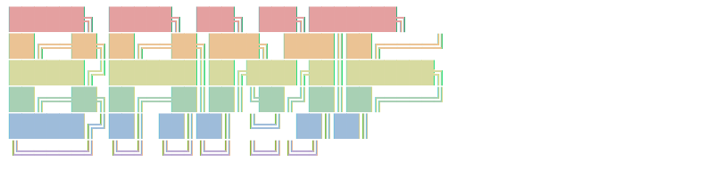
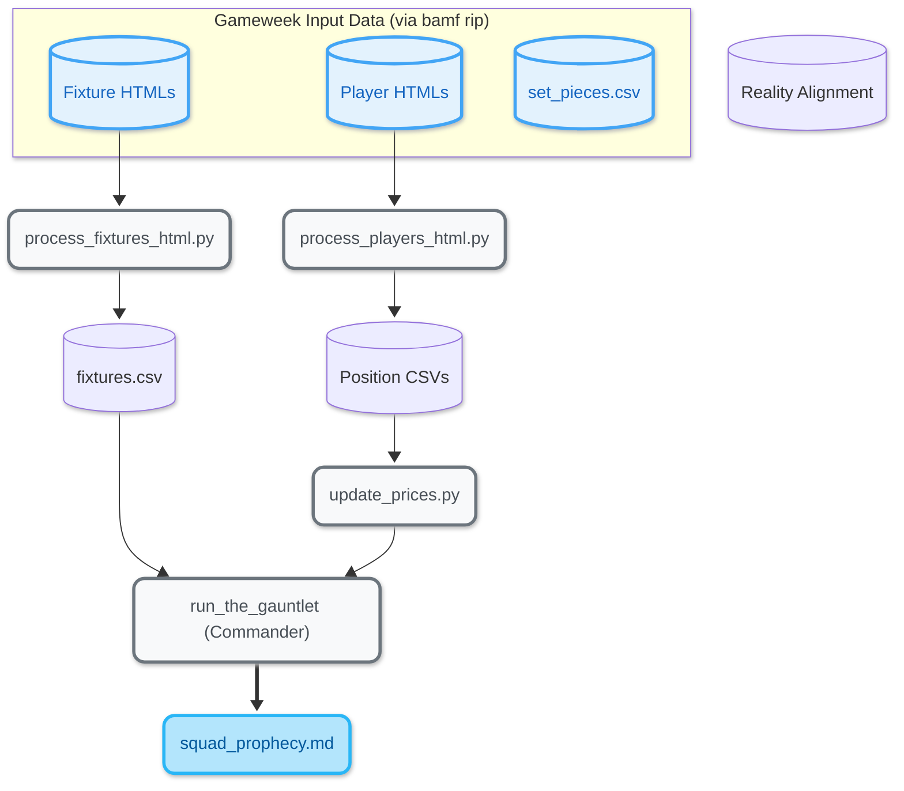

# PROJECT: BAMF DOMINATOR - OPERATIONAL GRIMOIRE (v5.1)



## MISSION STATEMENT

To systematically dismantle and dominate the Fantasy Premier League simulation by transforming raw, chaotic data into a decisive strategic advantage. This project is the home of the **Chimera**, a Python-based squad optimisation engine commanded via the `bamf` CLI. Our motto: **EX DATA, VICTORIA** (From Data, Victory).

---

## SETUP & INSTALLATION

To unleash the Chimera, you must first prepare the forge.

### 1. System Dependencies

The Chimera's heart, the `pyomo` model, requires a solver. We use `glpk` and `xclip` for clipboard integration.

```bash
# For Debian/Ubuntu-based systems
sudo apt-get update && sudo apt-get install -y glpk-utils xclip
```

### 2. Python Environment & Package Installation

We use `uv` for lightning-fast package management and install the project in "editable" mode.

```bash
# 1. Create and activate a virtual environment
uv venv
source .venv/bin/activate

# 2. Install the project (and dependencies) in editable mode
uv pip install -e .
```

### 3. Advanced Shell Integration (Optimised Auto-Complete & Performance)

```bash
# Forge the Completion Artefact
_BAMF_COMPLETE=bash_source bamf > ~/.bamf-complete.bash

# Update ~/.bashrc
# 1. Load optimised auto-completion
if [ -f ~/.bamf-complete.bash ]; then
    . ~/.bamf-complete.bash
fi
# 2. Disable GIL for Pandas/Numpy performance
export PYTHON_GIL=0
```

---

## THE COMMAND DECK (`bamf` CLI)

All operations are now channeled through our master command-line interface, `bamf`.

**Available Commands:**

- `init`: Creates a new, clean gameweek vault.
- `rip <target>`: Rips clipboard content directly into the **latest** vault (Targets: `fix`, `gkp`, `def`, `mid`, `fwd`, `squad`, etc.).
- `finalize`: Executes the full processing ritual (Fixtures -> Players -> Audit -> Solver).
- `run-gauntlet`: Executes the core data-to-squad pipeline.
- `audit`: A group of commands to inspect data integrity (`teams`, `players`).

---

## SYSTEM ARCHITECTURE

The `finalize` command automates the multi-stage pipeline, transforming raw clipboard rips into a final, optimized squad prophecy.


```mermaid
---
config:
  look: neo
---
graph TD
    subgraph inputs["Gameweek Input Data (via bamf rip)"]
        A1[("Player HTMLs")]
        A2[("Fixture HTMLs")]
        A3[("set_pieces.csv")]
    end

    B1("process_players_html.py")
    C1[("Position CSVs")]

    B2("process_fixtures_html.py")
    C2[("fixtures.csv")]

    B3("update_prices.py")
    C3[("Reality Alignment")]

    B4("run_the_gauntlet (Commander)")
    F1("squad_prophecy.md")

    A1 --> B1
    B1 --> C1
    A2 --> B2
    B2 --> C2
    C1 --> B3
    C2 --> B4
    B3 --> B4
    B4 ==> F1

    classDef inputStyle fill:#e3f2fd,stroke:#42a5f5,stroke-width:3px,color:#1565c0,rx:10,ry:10
    classDef processStyle fill:#f8f9fa,stroke:#6c757d,stroke-width:3px,color:#495057,rx:10,ry:10
    classDef outputStyle fill:#b3e5fc,stroke:#29b6f6,stroke-width:3px,color:#01579b,rx:10,ry:10

    class A1,A2,A3 inputStyle
    class B1,B2,B3,B4 processStyle
    class F1 outputStyle
```

---

## THE WEEKLY RITUAL (RIP Protocol v1.3)

This is the high-velocity workflow for the modern Carbon Pirate (π). For detailed steps, consult `protocols/BAMF-RFC-001_RIP.md`.

### Step 1: Initialise the Vault
```bash
bamf init gw29
```

### Step 2: The Ritual of the Rip
Navigate to FPL/FFS, Copy OuterHTML of the relevant tables, and unleash the Rip. **Note:** `rip` automatically targets the latest `gwX` directory.
*   `bamf rip fix` (Overall FDR)
*   `bamf rip fix-a` (Attack FDR)
*   `bamf rip fix-d` (Defence FDR)
*   `bamf rip gkp` (Goalkeepers)
*   `bamf rip def` / `bamf rip def2` (Defenders)
*   `bamf rip mid` / `bamf rip mid2` (Midfielders)
*   `bamf rip fwd` / `bamf rip fwd2` (Forwards)
*   `bamf rip squad` (Current Squad Prices)

### Step 3: The Single Strike
Review your `squad.csv` for Purchase Price (PP) accuracy, then finalize:
```bash
bamf finalize gw29
```

---

## THE ARSENAL: FILE MANIFEST

All Python source files are now located within the `src/fpl_dominator/` package.

- `src/fpl_dominator/bamf.py` (The Command Deck): The master script and sole entry point.
- `src/fpl_dominator/commander.py` (The Orchestrator): Contains the `run_the_gauntlet` logic.
- `src/fpl_dominator/process_players_html.py`: High-speed HTML table parser with deduplication.
- `src/fpl_dominator/process_fixtures_html.py`: Transmutes FFS HTML into structured fixture data.
- `src/fpl_dominator/update_prices.py`: Aligns market reality with your treasury.

---

## FUTURE CAMPAIGNS

For the grand strategic vision and our ongoing `(⇌)` evolution, consult the sacred text: `TODO.md`.

---
