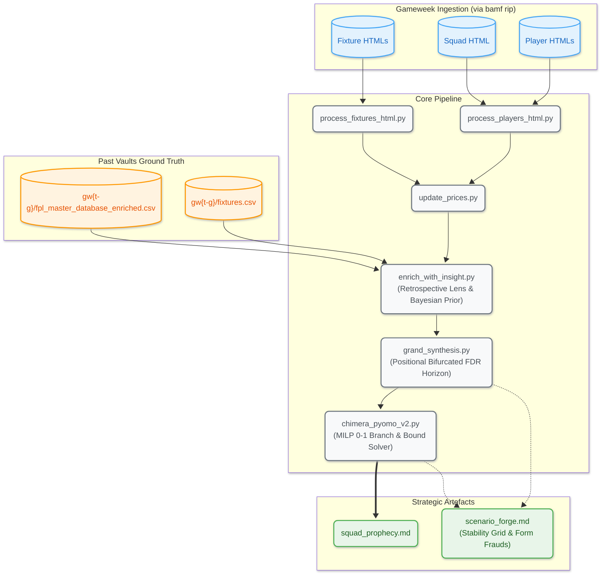
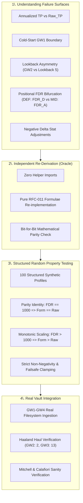

# PROJECT: BAMF DOMINATOR - OPERATIONAL GRIMOIRE (v6.0)


## MISSION STATEMENT

To systematically dismantle and dominate the Fantasy Premier League simulation by transforming raw, chaotic data into a decisive strategic advantage. This project is the home of the **Chimera**, a Python-based squad optimisation engine commanded via the `bamf` CLI. Our motto: **EX DATA, VICTORIA** (From Data, Victory).

---

## SETUP & REQUIREMENTS

To unleash the Chimera, you must first prepare the forge.

### 1. System Requirements & External Binaries

The Chimera optimization core requires a branch-and-bound MILP solver (`glpsol`), and the RIP Protocol requires system clipboard utilities across X11 and Wayland sessions.

```bash
# For Debian / Ubuntu (including 24.04 LTS / Pop!_OS)
sudo apt update && sudo apt install -y glpk-utils xclip wl-clipboard
```

- **`glpk-utils` (`glpsol`)**: The GNU Linear Programming Kit solver powering the Chimera MILP optimizations.
- **`xclip`**: X11 clipboard extraction tool.
- **`wl-clipboard` (`wl-paste`)**: Native Wayland clipboard extraction tool (standard on Ubuntu 24.04+ / GNOME Wayland).

### 2. Python Environment & Package Installation

We require **Python >= 3.10** (tested and optimized on Python 3.12 & 3.13) and use [`uv`](https://github.com/astral-sh/uv) for high-speed package management.

```bash
# 1. Install uv (if not already installed)
curl -LsSf https://astral.sh/uv/install.sh | sh

# 2. Create and activate a virtual environment
uv venv
source .venv/bin/activate

# 3. Install the project and all dependencies in editable mode
uv pip install -e .
```

### 3. Advanced Shell Integration (Optimised Auto-Complete & Performance)

```bash
# Forge the Completion Artefact
_BAMF_COMPLETE=bash_source bamf > ~/.bamf-complete.bash

# Update ~/.bashrc
# 1. Load optimised auto-completion
if [ -f ~/.bamf-complete.bash ]; then
    . ~/.bamf-complete.bash
fi
# 2. Disable GIL for Pandas/Numpy performance (Python 3.13 free-threaded builds)
export PYTHON_GIL=0
```

---

## THE COMMAND DECK (`bamf` CLI)

All operations are channeled through our master command-line interface, `bamf`.

**Core Lifecycle & Ritual Commands:**

- `init <gwX>`: Creates a new, clean gameweek vault.
- `rip <target>`: Rips clipboard content directly into the **latest** vault (`fix`, `fix-a`, `fix-d`, `gkp`, `def`, `def2`, `mid`, `mid2`, `fwd`, `fwd2`, `squad`).
- `finalize [gwX]`: Executes the **full** end-to-end processing ritual (HTML -> CSV -> Audit -> Retrospective Lens -> MILP Solver).
- `run-gauntlet [gwX]`: Executes the core data-to-squad optimization pipeline.
- `audit`: Diagnostic suite to inspect entity resolution and data integrity (`teams`, `players`).

**Strategic Sensitivity & Reconnaissance (`bamf forge`):**

- `forge [gwX]`: Executes in-memory Scenario Forge and Temporal Gradient analysis (RFC-008 & RFC-009).
  - `--steps <N>`: Single-axis gradient interpolation from current gameweek focus to deep horizon.
  - `--model [exponential|linear|step]`: Functional decay model archetype (default: `exponential`).
  - `--param-range <start,end>`: Extrema parameter range for gradient sweep (e.g. `0.0,1.0`).
  - `--matrix`: Multi-dimensional Cartesian grid search (`decay_rates` x `form_weights`).
  - `--compare-form`: Binary audit comparing Raw Form vs Retrospective Lens to unmask **Form Frauds** and surface **Sleepers** (RFC-011).
  - `--diff-first / --full`: Noise-suppressed stability matrix filtering unchanging bench assets.
  - `--color / --no-color`: ANSI rainbow color ramps visualizing selection robustness.

**Seasonal & Specialized Tools:**

- `archive-season <tag>`: Safely packages completed gameweek vaults into `archive/<tag>/`.
- `process-set-pieces`: Synthesizes empirical corner, free kick, and penalty delivery matrices from raw HTML.
- `process-prior-season`: Decodes full-year historical performance tables to prime Bayesian priors for GW1 cold start.
- `evaluate-wildcard`: Calculates squad divergence against production solutions to trigger optimal Wildcard chips (RFC-004).

---

## SYSTEM ARCHITECTURE

The end-to-end pipeline integrates temporal discounting for future fixtures with historical fixture difficulty adjustments for past form:


```mermaid
---
config:
  look: neo
---
graph TD
    subgraph Inputs["Gameweek Ingestion (via bamf rip)"]
        A1[("Player HTMLs")]
        A2[("Fixture HTMLs")]
        A3[("Squad HTML")]
    end

    subgraph Historical["Past Vaults Ground Truth"]
        H1[("gw{t-g}/fixtures.csv")]
        H2[("gw{t-g}/fpl_master_database_enriched.csv")]
    end

    subgraph Processors["Core Pipeline"]
        B1("process_players_html.py")
        B2("process_fixtures_html.py")
        B3("update_prices.py")
        B4("enrich_with_insight.py<br>(Retrospective Lens & Bayesian Prior)")
        B5("grand_synthesis.py<br>(Positional Bifurcated FDR Horizon)")
        B6("chimera_pyomo_v2.py<br>(MILP 0-1 Branch & Bound Solver)")
    end

    subgraph Outputs["Strategic Artefacts"]
        F1("squad_prophecy.md")
        F2("scenario_forge.md<br>(Stability Grid & Form Frauds)")
    end

    A1 & A3 --> B1
    A2 --> B2
    B1 & B2 --> B3
    B3 & H1 & H2 --> B4
    B4 --> B5
    B5 --> B6
    B6 ==> F1
    B5 & B6 -.-> F2

    classDef inputStyle fill:#e3f2fd,stroke:#42a5f5,stroke-width:2px,color:#1565c0,rx:8,ry:8
    classDef histStyle fill:#fff3e0,stroke:#ff9800,stroke-width:2px,color:#e65100,rx:8,ry:8
    classDef processStyle fill:#f8f9fa,stroke:#6c757d,stroke-width:2px,color:#495057,rx:8,ry:8
    classDef outputStyle fill:#e8f5e9,stroke:#4caf50,stroke-width:2px,color:#1b5e20,rx:8,ry:8

    class A1,A2,A3 inputStyle
    class H1,H2 histStyle
    class B1,B2,B3,B4,B5,B6 processStyle
    class F1,F2 outputStyle
```

---

## THE WEEKLY RITUAL (v2.0 - With Scenario Reconnaissance)

This is the high-velocity, four-step workflow for the modern Carbon Pirate (π). Zero manual data entry is required.

### Step 1: Initialise the Vault
Spawn the directory structure for the upcoming campaign:
```bash
bamf init gw4
```

### Step 2: The Ritual of the Rip
Navigate to FPL and Fantasy Football Scout, copy the OuterHTML of the relevant tables, and unleash the Rip (automatically directed to the newest vault):
```bash
bamf rip fix       # Overall FDR Ticker
bamf rip fix-a     # Attack FDR Ticker
bamf rip fix-d     # Defence FDR Ticker
bamf rip gkp       # Goalkeepers table
bamf rip def       # Defenders table 1
bamf rip def2      # Defenders table 2
bamf rip mid       # Midfielders table 1
bamf rip mid2      # Midfielders table 2
bamf rip fwd       # Forwards table 1
bamf rip fwd2      # Forwards table 2
bamf rip squad     # Current squad selling values & bank
```

### Step 3: The Scenario Reconnaissance (Sensitivity & Form Fraud Audit)
Before committing to transfers, interrogate the stability of the player pool using `bamf forge`:

1. **Unmask Form Frauds (RFC-011):**
   ```bash
   bamf forge gw4 --compare-form
   ```
   *Exposes players selected under raw form who stat-padded against weak defenses and are dropped once fixture difficulty is weighted.*

2. **Map the Survival Curves & Immortals (RFC-008 & RFC-009):**
   ```bash
   bamf forge gw4 --model exponential --steps 5
   ```
   *Reveals locked **Immortals** ($R=100\%$, e.g. Bruno Fernandes), **Horizon-Dependents**, and short-term **Pure Punts** (e.g. Erling Haaland).*

### Step 4: The Single Strike (Finalize)
Execute the complete end-to-end transformation and generate the squad prophecy:
```bash
bamf finalize gw4
```
*Executes HTML parsing, reality reconciliation, Bayesian shrinkage, Retrospective Lens FDR-weighting, and solves the sovereign MILP squad, outputting `gw4/squad_prophecy.md`.*

---

## TESTING & DEFENSIVE INVARIANTS (DAN LUU METHODOLOGY)

To guarantee the mathematical integrity of the Chimera optimization core and eradicate regression gremlins (such as Bayesian annualized prior leakage during snapshot fallbacks), the codebase enforces a rigorous testing regimen inspired by **Dan Luu's Testing Heuristics** and structured around **Polya's Problem-Solving Engine**:


```mermaid
flowchart TD
    subgraph Step1["1\. Understanding Failure Surfaces"]
        A["Annualized TP vs Raw_TP"]
        B["Cold-Start GW1 Boundary"]
        C["Lookback Asymmetry (GW2 vs Lookback 5)"]
        D["Positional FDR Bifurcation (DEF: FDR_D vs MID: FDR_A)"]
        E["Negative Delta Stat Adjustments"]
    end

    subgraph Step2["2\. Independent Re-Derivation (Oracle)"]
        F["Zero Helper Imports"]
        G["Pure RFC-011 Formulae Re-implementation"]
        H["Bit-for-Bit Mathematical Parity Check"]
    end

    subgraph Step3["3\. Structured Random Property Testing"]
        I["100 Structured Synthetic Profiles"]
        J["Parity Identity: FDR == 1000 => Form == Raw"]
        K["Monotonic Scaling: FDR > 1000 => Form > Raw"]
        L["Strict Non-Negativity & Failsafe Clamping"]
    end

    subgraph Step4["4\. Real Vault Integration"]
        M["GW1-GW4 Real Filesystem Ingestion"]
        N["Haaland Haul Verification (GW2: 2, GW3: 13)"]
        O["Mitchell & Calafiori Sanity Verification"]
    end

    Step1 --> Step2 --> Step3 --> Step4
```

### Running the Test Battery

All tests are orchestrated via Python's standard `unittest` suite executed through `uv`:

```bash
# Execute entire test crucible (Chimera, Scenario Forge, Temporal Decay, Retrospective Lens)
uv run python -m unittest discover tests

# Execute targeted Dan Luu test suite for Retrospective Lens (RFC-011)
uv run python -m unittest -v tests.test_retrospective_lens

# Enforce strict code formatting and linter quality gates
uv run ruff check . && uv run ruff format --check .
```

---

## THE ARSENAL: FILE MANIFEST

All core package sources reside within `src/fpl_dominator/`:

- `src/fpl_dominator/bamf.py`: The master command deck and entry point.
- `src/fpl_dominator/retrospective_lens.py`: Pure historical FDR extraction and contextual efficiency calculator (RFC-011).
- `src/fpl_dominator/scenario_forge.py`: Multi-scenario in-memory MILP stability engine and Form Fraud classifier (RFC-008).
- `src/fpl_dominator/temporal_decay.py`: Functional decay weighting algorithms (exponential, linear, step) and gradient interpolators (RFC-009).
- `src/fpl_dominator/chimera_pyomo_v2.py`: The decoupled Pyomo MILP optimization core.
- `src/fpl_dominator/commander.py`: Atomic pipeline orchestrator.
- `src/fpl_dominator/enrich_with_insight.py`: Bayesian prior cold start and captaincy coefficient synthesis.
- `src/fpl_dominator/grand_synthesis.py`: Positional bifurcation and temporal fixture horizon discounting.
- `src/fpl_dominator/process_players_html.py`: High-speed HTML table parser for player rosters and squad prices.
- `src/fpl_dominator/process_fixtures_html.py`: HTML fixture ticker decoder converting RGB styles to FDR metrics.
- `src/fpl_dominator/update_prices.py`: Bank balance and selling profit tax reconciliation.
- `src/fpl_dominator/wildcard_evaluator.py`: Squad divergence analysis for optimal chip timing.

**Test Battery & Invariant Fortresses:**

- `tests/test_retrospective_lens.py`: Dan Luu-style edge cases, independent oracle, property invariants, and vault integration (RFC-011).
- `tests/test_scenario_forge.py`: Multi-scenario Cartesian and gradient matrix testing (RFC-008, RFC-009).
- `tests/test_temporal_decay.py`: Functional decay weighting algorithms and mathematical clamping tests.
- `tests/test_in_memory_solver.py`: 5-run anti-gambit solver memory isolation and parity checks.

---

## KNOWLEDGE & STRATEGIC FOUNDATIONS

- **Living Grimoire:** Compiled architectural knowledge resides in `wiki/` (symlinked from `.agents/skills/fpl-machine-studying-wiki/wiki`).
- **RFC Lifecycle Archive:** Ingested ground-truth specifications reside in `wiki/raw/specs/` (RFC-001, RFC-002, RFC-004, RFC-008, RFC-009, RFC-011).
- **Active Proposals:** In-flight RFC drafts reside in `specs/` (RFC-003, RFC-005, RFC-006, RFC-007, RFC-010).
- **Roadmap:** Consult `TODO.md` for active development sprints.
