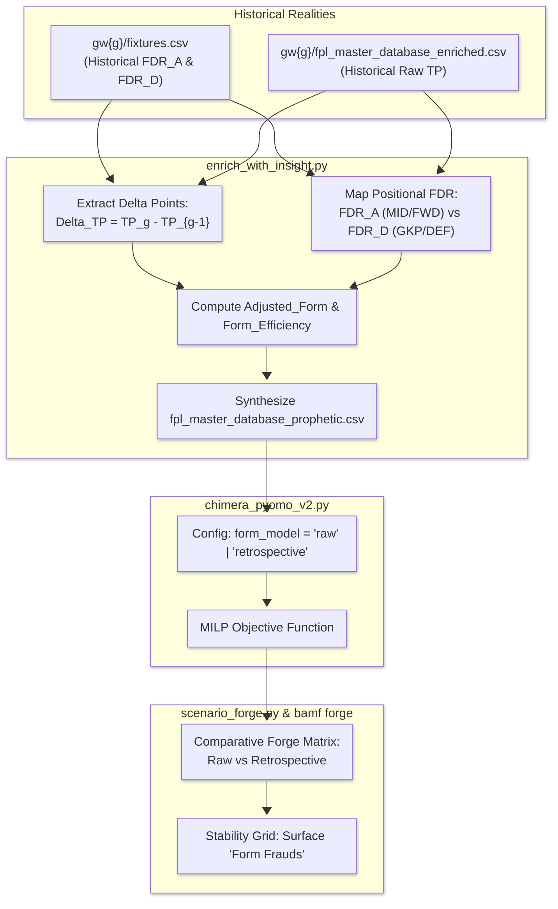

# BAMF DOMINATOR - IMPLEMENTATION ROADMAP: THE RETROSPECTIVE LENS
**Target RFC:** [wiki/raw/specs/RFC-011_Retrospective_Lens.md](./wiki/raw/specs/RFC-011_Retrospective_Lens.md)  
**Branch:** `feat/rfc-011-retrospective-lens`  
**Status:** Completed `(⊕) (⇌)`  
**Objective:** Eliminate the "Stat-Padding" Fallacy by weighting past player points with historical fixture difficulty (FDR), forging Contextual Efficiency, and surfacing Form Frauds in the Scenario Forge.

---

## 🏛️ ARCHITECTURAL SPECIFICATION



---

## 🔬 VERIFICATION PROTOCOL & QUALITY GATE (MANDATORY)

Every task executed MUST strictly satisfy the following before being committed:
1. **Deterministic Verification:** Execute the exact command specified in the task's `*Verification*` block.
2. **Pass Criteria Evaluation:** Zero exceptions, proper mathematical invariants, correct dataframe schemas.
3. **Ruff Quality Gate:**
   ```bash
   uv run ruff check . && uv run ruff format --check .
   ```
4. **Single-Threaded Execution:** Execute sequentially, update checkbox, commit cleanly.

---

## 🧗 INCREMENTAL STEPPING STONES (ACTIVE EXECUTION QUEUE)

```
[Stone 1: Pure Extractor Engine]  --> Historical FDR & delta points calculator with unit assertions. [DONE]
        │
[Stone 2: Pipeline Integration]   --> Wire into enrich_with_insight.py; populate Adjusted_Form & Form_Efficiency. [DONE]
        │
[Stone 3: Solver & Config]        --> Parameterize form_model in chimera_pyomo_v2.py & config.yaml. [DONE]
        │
[Stone 4: Scenario Forge Audit]   --> Enable bamf forge --compare-form; unmask Form Frauds & Sleepers. [DONE]
        │
[Stone 5: Living Grimoire]        --> Author wiki node, update index.md and log.md. [DONE]
        │
[Stone 6: Dan Luu Test Crucible]  --> Fortify invariants, independent oracle, and property tests. [DONE]
```

- [x] **Stone 1: Historical FDR & Points Delta Extractor (Pure Logic)**
  - **Action:** Implement `extract_historical_fixture_fdr()` and `calculate_retrospective_points()` in a modular helper or directly in `enrich_with_insight.py`.
  - **Blast Radius:** Minimal. Pure functions reading historical vault CSVs.
  - **Verification:** `uv run python -c "from fpl_dominator.retrospective_lens import extract_historical_fixture_fdr; fdr_map = extract_historical_fixture_fdr(4, 2); assert len(fdr_map) > 0; print('STONE 1 HISTORICAL FDR EXTRACTOR PASSED')"`
  - **Pass Criteria:** Successfully extracts historical FDRs for GW2 and GW3 across all active clubs.

- [x] **Stone 2: Pipeline Integration & Gremlin Extermination (`enrich_with_insight.py`)**
  - **Action:**
    1. Preserve `Raw_TP` defensively before Bayesian prior synthesis.
    2. Replace the naive `players["TP"] - players["TP_past"]` subtraction with true historical delta calculation.
    3. Calculate `Adjusted_Form` and `Form_Efficiency` per player using positional bifurcation.
    4. Write both metrics to `fpl_master_database_prophetic.csv`.
  - **Blast Radius:** `src/fpl_dominator/enrich_with_insight.py`.
  - **Verification:** `uv run python -m fpl_dominator.enrich_with_insight gw4`
  - **Pass Criteria:** `fpl_master_database_prophetic.csv` contains valid `Adjusted_Form` and `Form_Efficiency` columns without NaNs.

- [x] **Stone 3: Pyomo Solver & Master Config Integration**
  - **Action:**
    1. Update `config.yaml` to declare `form_model: "retrospective"` (with `"raw"` fallback).
    2. Update `chimera_pyomo_v2.py` `solve_chimera_squad` to read `form_model` and switch between `Form_Factor` and `Adjusted_Form`.
  - **Blast Radius:** `config.yaml`, `src/fpl_dominator/chimera_pyomo_v2.py`.
  - **Verification:** `uv run python -c "from fpl_dominator.chimera_pyomo_v2 import solve_chimera_squad; import pandas as pd; df = pd.read_csv('gw4/fpl_master_database_OMNISCIENT.csv'); sol = solve_chimera_squad(df); print('STONE 3 SOLVER SOLVED SQUAD:', len(sol.squad))"`
  - **Pass Criteria:** MILP solves to optimality using `Adjusted_Form`.

- [x] **Stone 4: Scenario Forge Audit & Form Fraud Detection**
  - **Action:**
    1. Extend `ScenarioParams` in `src/fpl_dominator/scenario_forge.py` to support `form_model`.
    2. Add CLI flag `--compare-form` to `bamf forge`.
    3. Generate side-by-side comparison isolating "Form Frauds" (players selected under raw form but dropped under retrospective form).
  - **Blast Radius:** `src/fpl_dominator/scenario_forge.py`, `src/fpl_dominator/bamf.py`.
  - **Verification:** `uv run bamf forge gw4 --compare-form`
  - **Pass Criteria:** CLI output displays stability matrix and correctly highlights form sensitivity (unmasking Ajayi as Form Fraud, Van Hecke as Sleeper).

- [x] **Stone 5: Living Grimoire Distillation (`SKILL.md`)**
  - **Action:**
    1. Author `wiki/concepts/The-Retrospective-Lens-and-Contextual-Form.md` under the 4-Part Mental Model.
    2. Update `wiki/index.md` with $\le 12$-word peripheral retina link.
    3. Append milestone to `wiki/log.md`.
  - **Blast Radius:** `wiki/`.
  - **Verification:** Check links and run wiki-lint if available.

- [x] **Stone 6: Dan Luu Test Crucible & Defensive Invariant Verification (`SKILL.md`)**
  - **Action:**
    1. Implement pre-implementation edge cases and asymmetric boundaries (GW1 cold start, lookback overshoot, negative delta clamping, positional bifurcation).
    2. Add regression test for the historical snapshot fallback bug (`Raw_TP / (gw - 1)` vs annualized Bayesian `TP`).
    3. Build independent mathematical oracle re-derivation without production helpers or shared module constants.
    4. Implement structured random property testing verifying parity identity, monotonic scaling, and non-negativity across 100 profiles.
    5. Validate real vault integration against `gw1`–`gw4` data.
  - **Blast Radius:** `tests/test_retrospective_lens.py`, `README.md`.
  - **Verification:** `uv run python -m unittest -v tests.test_retrospective_lens`
  - **Pass Criteria:** 14/14 tests pass cleanly with zero lint or formatting regressions.

