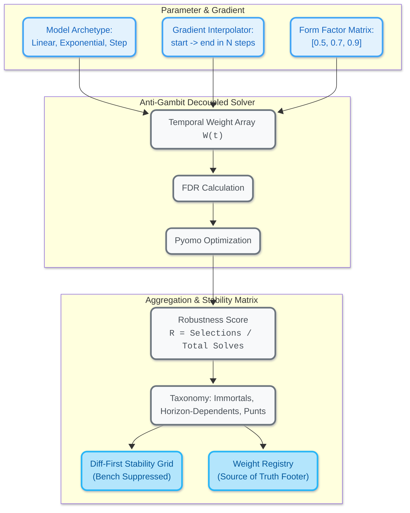

# BAMF DOMINATOR - IMPLEMENTATION ROADMAP: THE SCENARIO FORGE & TEMPORAL GRADIENTS
**Target RFCs:** [specs/RFC-008_Scenario_Forge.md](./specs/RFC-008_Scenario_Forge.md) & [specs/RFC-009_Temporal_Archetypes.md](./specs/RFC-009_Temporal_Archetypes.md)  
**Status:** Inception & Architectural Formulation `(⊕)`  
**Objective:** Eliminate the "Tweak and Pray" cycle by forging an automated sensitivity analysis and gradient evaluation engine (`bamf forge`) that identifies Immortal Assets, Horizon-Dependents, and Pure Punts across functional parameterizations of temporal decay.

---

## 🏛️ ARCHITECTURAL SPECIFICATION



---

## 🔬 VERIFICATION PROTOCOL & QUALITY GATE (MANDATORY)

Every task executed under the [PROMPT.md](./PROMPT.md) execution loop MUST strictly satisfy the following before being marked as done or committed:

1. **Deterministic Verification:** Execute the exact command specified in the task's `*Verification*` block.
2. **Pass Criteria Evaluation:** The result must satisfy all declarative pass conditions (zero exceptions, correct mathematical invariants, proper return shapes).
3. **Ruff Quality Gate:** Prior to every commit, run:
   ```bash
   uv run ruff check . && uv run ruff format --check .
   ```
   If formatting or lint issues are flagged, run `uv run ruff format .` and resolve all lints before committing.
4. **Single-Threaded Execution:** Execute exactly ONE task per turn. Archive scratch files to `temp/[task-name]/`, log entry to `progress.txt`, update checkbox, commit, and HALT.

---

## 🧗 INCREMENTAL STEPPING STONES (ACTIVE EXECUTION QUEUE)

To avoid jumping off an architectural cliff, we decompose the grand vision into 4 pragmatic stepping stones. Each stone delivers tangible tactical value immediately with minimal diff footprint.

```
[Stone 1: Micro-Spike]      --> Pure math functions (30 lines). Zero solver surgery.
        │
[Stone 2: The 3-Solve Spike] --> Standalone comparison script running 3 decay rates on GW3.
        │
[Stone 3: Minimal CLI]       --> Wrap Stone 2 into `bamf forge --steps 3`.
        │
[Stone 4: Full Sovereign]    --> Full in-memory solver, Cartesian matrix & Grimoire.
```

- [x] **Stone 1: The Micro-Spike (Pure Math in `temporal_decay.py`)**
  - **Action:** Create `src/fpl_dominator/temporal_decay.py` with `generate_linear_weights`, `generate_exponential_weights`, and `generate_step_weights`.
  - **Blast Radius:** Zero. No existing files modified.
  - **Verification:** `uv run python -c "from fpl_dominator.temporal_decay import generate_exponential_weights, generate_linear_weights, generate_step_weights; assert generate_exponential_weights(0.5) == [1.0, 0.5, 0.25, 0.125, 0.0625]; assert generate_linear_weights(0.2) == [1.0, 0.8, 0.6, 0.4, 0.2]; assert generate_step_weights(3) == [1.0, 1.0, 1.0, 0.0, 0.0]; print('ALL STONE 1 WEIGHT CHECKS PASSED')"`
  - **Pass Criteria:** Assertions exit with code 0 and print confirmation; $W(0) = 1.0$; $W(t) \ge 0$.
  - **Lint & Format:** `uv run ruff check src/fpl_dominator/temporal_decay.py && uv run ruff format --check src/fpl_dominator/temporal_decay.py`

- [x] **Stone 2: The 3-Solve Comparison Script**
  - **Action:** Create standalone script `src/fpl_dominator/compare_decay_scenarios.py` that runs the existing pipeline with 3 profiles:
    1. *Eternalist (Flat):* `[1.0, 1.0, 1.0, 1.0, 1.0]`
    2. *Balanced (Moderate):* `generate_exponential_weights(0.6)`
    3. *Sniper (Aggressive):* `generate_exponential_weights(0.2)`
  - **Blast Radius:** Minimal. Standalone script utilizing existing `perform_grand_synthesis` and `forge_pyomo_squad`.
  - **Verification:** `uv run python -m fpl_dominator.compare_decay_scenarios gw3`
  - **Pass Criteria:** Exits with code 0; outputs side-by-side Starting XI comparison table across the 3 decay profiles; identifies locked Immortals (e.g. Haaland, Bruno).
  - **Lint & Format:** `uv run ruff check src/fpl_dominator/compare_decay_scenarios.py && uv run ruff format --check src/fpl_dominator/compare_decay_scenarios.py`

- [x] **Stone 3: The Minimal CLI Command (`bamf forge`)**
  - **Action:** Wire the Stone 2 comparison into `bamf.py` under command `bamf forge [gwX] --steps 3`.
  - **Blast Radius:** Surgical addition to `bamf.py`.
  - **Verification:** `uv run bamf forge gw3 --steps 3`
  - **Pass Criteria:** Renders the stability comparison to terminal and writes `gw3/forge_summary.md` with status code 0.
  - **Lint & Format:** `uv run ruff check src/fpl_dominator/bamf.py && uv run ruff format --check src/fpl_dominator/bamf.py`

- [ ] **Stone 4: Full Sovereign Forge (Detailed Architectural Roadmap)**
  - **Action:** Proceed into full multi-dimensional matrix, in-memory solver decoupling, and Grimoire distillation (Phases 1-6 below).
  - **Verification:** `uv run pytest` or full gauntlet suite.
  - **Pass Criteria:** All matrix combinations solved without file I/O collisions; Grimoire nodes pass `wiki-lint`.

---

## 📋 FULL ARCHITECTURAL TASK LIST (REFERENCE ROADMAP)

### Phase 1: Mathematical Foundations (Weight Generators & Gradients)
- [x] **Task 1.1: Functional Decay Functions** (`src/fpl_dominator/temporal_decay.py`)
  - [x] Implement `generate_linear_weights(slope: float, horizon: int = 5) -> list[float]` where $W(t) = \max(0.0, 1.0 - t \times \text{slope})$.
  - [x] Implement `generate_exponential_weights(decay_rate: float, horizon: int = 5) -> list[float]` where $W(t) = \text{decay\_rate}^t$.
  - [x] Implement `generate_step_weights(cutoff: int, horizon: int = 5) -> list[float]` where $W(t) = 1.0 \text{ if } t < \text{cutoff else } 0.0$.
  - [x] Add strict validation: $W(0) = 1.0$, non-negative weights, non-zero sum, horizon length sanity check.
- [x] **Task 1.2: Parameter Interpolation & Signature Generator**
  - [x] Implement `interpolate_gradient(start: float, end: float, steps: int) -> list[float]`.
  - [x] Implement `generate_scenario_signature(model: str, param: float, form_weight: float | None = None) -> str` (e.g., `EXP:0.75`, `LIN:0.20`, `STEP:3`).
- [x] **Task 1.3: Unit Tests for Weight Generators**
  - [x] Create `tests/test_temporal_decay.py` validating boundary conditions ($N=5$, $decay=0.0 \rightarrow [1, 0, 0, 0, 0]$, $decay=1.0 \rightarrow [1, 1, 1, 1, 1]$).

---

### Phase 2: Solver Decoupling & In-Memory Execution Harness
- [x] **Task 2.1: Refactor `grand_synthesis.py` for Parametric Injection**
  - [x] Extract core weighting logic from [grand_synthesis.py](file:///home/ian/Projects/fpl-dominator/src/fpl_dominator/grand_synthesis.py) into a pure function `synthesize_omniscient_data(players_df, fixtures_df, fixture_weights) -> pd.DataFrame`.
  - [x] Retain backwards compatibility for CLI and `run_the_gauntlet`.
- [x] **Task 2.2: Refactor `chimera_pyomo_v2.py` for In-Memory Solving**
  - [x] Separate model construction and solver invocation from file disk I/O.
  - [x] Implement `solve_chimera_squad(omniscient_df, set_pieces_path, solver_config) -> SquadSolution` returning structured dataclasses (`starting_xi`, `bench`, `total_score`, `total_cost`, `bank`).
  - [x] Eliminate temporary disk collisions during multi-scenario runs.
- [x] **Task 2.3: Anti-Gambit Smoke Test**
  - [x] Verify that running 5 consecutive in-memory solves produces identical results to the disk-based baseline without state leakage or variable cross-talk.

---

### Phase 3: The Scenario Forge Runner & Aggregator
- [x] **Task 3.1: Scenario Matrix Builder** (`src/fpl_dominator/scenario_forge.py`)
  - [x] Build `ScenarioDefinition` dataclass containing `name`, `model_type`, `param_value`, `weights`, `form_factor_weight`.
  - [x] Implement Cartesian product generator for multi-dimensional grid exploration (`decay_rate` $\times$ `form_factor_weight`).
  - [x] Implement gradient generator for single-axis interpolation (RFC-009).
- [x] **Task 3.2: Execution Loop & Robustness Calculation**
  - [x] Implement `run_scenario_matrix(gameweek_dir, scenarios) -> ScenarioRunReport`.
  - [x] Calculate **Robustness Score**:
    $$R(p) = \frac{\text{Count of appearances in Starting XI}}{\text{Total successful scenario solves}}$$
  - [x] Implement survival curve classifier:
    - **The Immortals:** $R(p) = 1.0$ (Selected across all parameter permutations).
    - **The Horizon-Dependents:** Selected only when decay is gentle / horizon is deep.
    - **The Pure Punts:** Selected only under aggressive decay / hyper-short horizons.
    - **The Fringe / Volatile:** Selected intermittently across boundary conditions.

---

### Phase 4: Diff-First Visualization (Stability Grid & Weight Registry)
- [x] **Task 4.1: Diff-First Noise Suppression**
  - [x] Filter out bench players that do not change across scenarios.
  - [x] Highlight starting XI alterations with visual divergence cues.
- [x] **Task 4.2: Terminal & Markdown Matrix Formatter**
  - [x] Build ASCII / Rich table for terminal CLI output:
    - Rows: Position + Player Surname.
    - Columns: Scenario Signatures (`EXP:1.0`, `EXP:0.75`, `EXP:0.5`, `EXP:0.25`, `EXP:0.0`).
    - Cells: `[X]` (Selected Starter), `[b]` (Bench), `.` (Unselected).
  - [x] Build the **Weight Registry Footer**:
    ```text
    --- WEIGHT REGISTRY (SOURCE OF TRUTH) ---
    EXP:1.00  -> [1.00, 1.00, 1.00, 1.00, 1.00]
    EXP:0.75  -> [1.00, 0.75, 0.56, 0.42, 0.31]
    EXP:0.50  -> [1.00, 0.50, 0.25, 0.12, 0.06]
    EXP:0.25  -> [1.00, 0.25, 0.06, 0.01, 0.00]
    EXP:0.00  -> [1.00, 0.00, 0.00, 0.00, 0.00]
    ```
  - [x] Write detailed report to `{gameweek_dir}/scenario_forge.md`.

---

### Phase 5: CLI Command Deck Integration (`bamf.py`)
- [ ] **Task 5.1: Wire Up `bamf forge`**
  - [ ] Add command to [bamf.py](file:///home/ian/Projects/fpl-dominator/src/fpl_dominator/bamf.py):
    ```bash
    bamf forge [gwX] --model exponential --param-range 1.0,0.0 --steps 5
    bamf forge [gwX] --model linear --param-range 0.1,0.5 --steps 5
    bamf forge [gwX] --matrix --form-weights 0.5,0.7,0.9 --decay-rates 0.4,0.6,0.8
    ```
  - [ ] Implement smart defaults (targets latest active GW directory automatically).
- [ ] **Task 5.2: Terminal Formatting & Rainbow Integration**
  - [ ] Style the output with ANSI color ramps reflecting player robustness (e.g., bright green for Immortals, cyan for Horizon-Dependents, magenta for Punts).

---

### Phase 6: Living Grimoire & Verification Cycle
- [ ] **Task 6.1: Run Verification on GW3 / GW4 Reality**
  - [ ] Execute `bamf forge gw3 --model exponential --steps 5` against our active September 2026 dataset.
  - [ ] Verify if Haaland (£15.5m) and Bruno Fernandes (£12.0m) qualify as mathematical "Immortals".
- [ ] **Task 6.2: Knowledge Base Distillation**
  - [ ] Author `wiki/concepts/The-Scenario-Forge.md` conforming to the 4-Part Mental Model.
  - [ ] Author `wiki/concepts/Temporal-Gradients-and-Survival-Curves.md`.
  - [ ] Update [wiki/index.md](file:///home/ian/Projects/fpl-dominator/wiki/index.md) (retina scan links $\le 12$ words).
  - [ ] Append execution milestone to [wiki/log.md](file:///home/ian/Projects/fpl-dominator/wiki/log.md).
