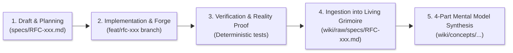

# BAMF Dominator RFC Repository

This directory houses **in-flight, active proposals, and planned RFCs** for the BAMF Dominator architecture.

---

## The RFC Lifecycle & Machine Studying Archival Protocol

1. **Active Proposals (`specs/`):** New architectural initiatives, mathematical models, and feature specifications are drafted in `specs/`.
2. **Implementation & Verification:** Features are developed on dedicated feature branches with deterministic verification commands and pass criteria.
3. **Canonical Archival (`wiki/raw/specs/`):** Once an RFC is **IMPLEMENTED** and verified on live Premier League data, it is migrated into Layer 1 (The Raw Immutable Ingestion Layer) at `wiki/raw/specs/`.
4. **Grimoire Distillation (`wiki/concepts/`):** The core mathematical invariants, typed patterns, and operational protocols from the RFC are compiled into the Living Grimoire (`wiki/`) under the 4-Part Mental Model schema.

---

## Active & Planned Proposals in `specs/`

| RFC | Title | Status | Primary Focus |
| :--- | :--- | :--- | :--- |
| **RFC-003** | [Trajectory Optimization & Transition Friction](./RFC-003_Trajectory_Optimization.md) | PLANNED | Multi-period rolling horizon MILP with transfer transaction costs. |
| **RFC-005** | [Bayesian Prior Calibration & Regime Adaptation](./RFC-005_Bayesian_Prior_Calibration.md) | PARTIAL / IN PROGRESS | Underlying process metrics (xG, xA) and managerial regime vectors (MRV). |
| **RFC-006** | [Stochastic Expected Minutes](./RFC-006_Stochastic_Expected_Minutes.md) | PLANNED | Probabilistic minute distributions and rotation risk modeling. |
| **RFC-007** | [Early Season Liquidity](./RFC-007_Early_Season_Liquidity.md) | PLANNED | Capital preservation and team value appreciation dynamics. |
| **RFC-010** | [The Equation Audit](./RFC-010_Equation_Audit.md) | PLANNED | Stress-testing the Chimera Final Score equation against additive and multiplicative variants. |

---

## Implemented & Ingested RFCs in `wiki/raw/specs/`

Completed RFCs reside as permanent historical ground truth in Layer 1 of the Machine Studying Wiki:

- **RFC-001:** [The Temporal Lens](../wiki/raw/specs/RFC-001_Temporal_Lens.md) *(Synthesized in `wiki/Temporal-Discounting-and-FDR.md`)*
- **RFC-002:** [Automated Ingestion Protocol](../wiki/raw/specs/RFC-002_Automated_Ingestion.md) *(Synthesized in `wiki/The-BAMF-CLI-Ritual.md`)*
- **RFC-004:** [The Wildcard Trigger](../wiki/raw/specs/RFC-004_Wildcard_Trigger.md) *(Synthesized in `src/fpl_dominator/wildcard_evaluator.py`)*
- **RFC-008:** [The Scenario Forge](../wiki/raw/specs/RFC-008_Scenario_Forge.md) *(Synthesized in `wiki/concepts/The-Scenario-Forge.md`)*
- **RFC-009:** [Temporal Gradients & Survival Curves](../wiki/raw/specs/RFC-009_Temporal_Archetypes.md) *(Synthesized in `wiki/concepts/Temporal-Gradients-and-Survival-Curves.md`)*
- **RFC-011:** [The Retrospective Lens](../wiki/raw/specs/RFC-011_Retrospective_Lens.md) *(Synthesized in `wiki/concepts/The-Retrospective-Lens-and-Contextual-Form.md`)*
